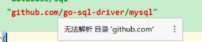
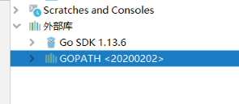
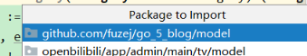

# 2.17

# 问题
1.

    1. 没有外部库没有GOPATH？？？:
        把 .idea 删除即可 
        ——》 尚硅谷 能运行的情况下 在同级目录中 创建其他项目却不行
        ——》  外部库没有导入 GOPATH ——》 IDE 的问题
        ——》 .idea
2.

    包路径 和 GOPATH 的区别 
    Ctrl + Alt + 右键 ——》 打开 Terminal
    当前 main.go  ——》 run .\main.go